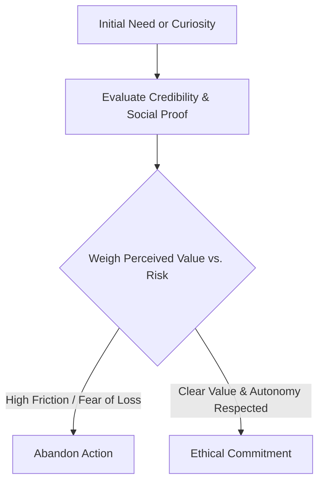

# Chapter 1: Persuasion and Human Decision-Making

## What is Persuasion?
Persuasion is the intentional effort to influence a person's attitudes, beliefs, or behaviors through communication while preserving their voluntary choice. It operates by presenting reasoning, context, and emotional resonance to guide someone toward an agreeable conclusion.

## Persuasion vs. Manipulation
Persuasion is not the same thing as manipulation. Persuasion relies on transparency, respect for the audience's autonomy, and factual representation. In contrast, manipulation uses concealment, deceit, or emotional exploitation to force a decision that primarily benefits the manipulator at the expense of the target.

## Robert Cialdini's Principles of Influence
Psychologist Robert Cialdini identified key behavioral shortcuts that guide human choices:
- **Reciprocity:** People feel obligated to return favors or concessions.
- **Scarcity:** People assign higher value to opportunities that are limited or dwindling.
- **Authority:** People defer to credible, knowledgeable experts.
- **Consistency:** People align actions with their previous commitments and self-image.
- **Liking:** People are more readily persuaded by those they like, find similar, or admire.
- **Consensus (Social Proof):** People look to the actions and behaviors of others when uncertain.
- **Unity:** A shared identity ("we are one of us") drives heightened cooperation.

## Additional Decision-Making Concepts
1. **Framing Effect:** The way information is presented (e.g., "95% lean" vs. "5% fat") drastically alters how value and risk are perceived.
2. **Loss Aversion:** A principle from behavioral economics demonstrating that the psychological pain of losing something is approximately twice as powerful as the pleasure of gaining the equivalent amount.

## Principles in Practice

| Principle | Mechanism | Ethical Use | Misuse Risk |
| :--- | :--- | :--- | :--- |
| **Reciprocity** | Obligation to repay debts or kindness | Giving valuable insights or free tools before asking for business | Creating manufactured debts to pressure vulnerable individuals |
| **Scarcity** | Perceived urgency driven by loss aversion | Highlighting real deadlines and limited production capacity | Fabricating fake countdown timers or artificial shortages |
| **Social Proof** | Reducing uncertainty by observing peers | Sharing verified customer reviews and authentic metrics | Planting astroturfed testimonials or inflated user figures |
| **Authority** | Trust based on demonstrated expertise | Citing genuine credentials and peer-reviewed research | Flaunting irrelevant credentials or paid actor endorsements |

## Decision Journey

## Questions to Ask Before Trying to Persuade
- Is this communication truthful and transparent?
- Does the audience retain genuine freedom of choice?
- Will this action serve the long-term interest of the audience, or only my own?
- Would I feel comfortable defending these persuasive tactics publicly?

## The Plain White T-Shirt
A plain white T-shirt has minimal intrinsic utility—it is simple stitched cotton. How it is framed determines its perceived value:
- Framed through **authority and craftsmanship**, it becomes an indispensable wardrobe foundation recommended by heritage designers.
- Framed through **social proof and belonging**, it becomes the minimalist uniform of innovators and creatives.