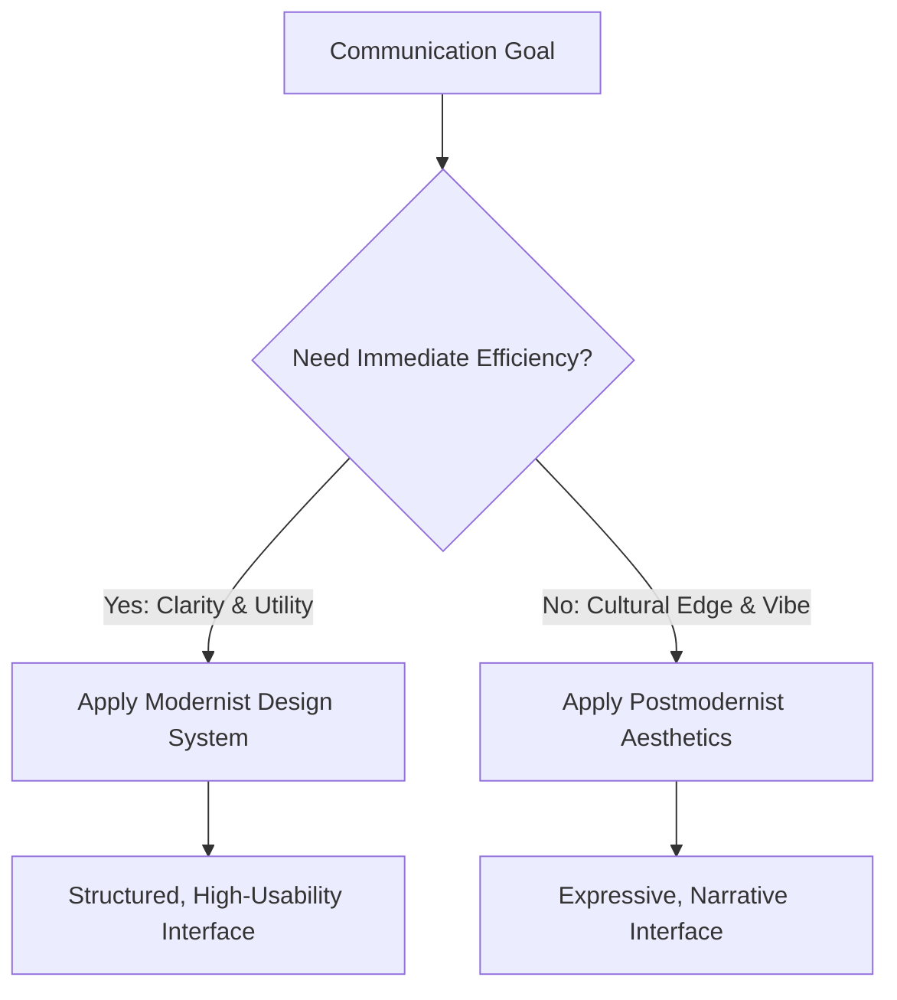

# Chapter 3: Visual Design Language: Modernism and Postmodernism

## Understanding Design Movements
Visual language dictates how information is structured and emotionally interpreted. Two primary 20th-century philosophies continue to drive web aesthetics: Modernism and Postmodernism.

## Modernism: Form Follows Function
Modernist design (rooted in Bauhaus and the Swiss Style) emphasizes rationalism, clarity, objectivity, and universal accessibility.
- **Grid Systems:** Strict adherence to structured layouts.
- **Hierarchy:** Immediate cognitive parsing through size, weight, and position.
- **Typography:** Neutral, highly readable sans-serif typefaces (e.g., Helvetica).
- **Simplicity:** Stripping away superfluous ornamentation.

## Postmodernism: Expression and Deconstruction
Postmodernist design rejects the universal rules and sterile efficiency of Modernism, celebrating irony, pluralism, visual friction, and subjective emotion.
- **Broken Grids:** Overlapping layers, asymmetrical collisions, and unexpected flow.
- **Expressive Typography:** Mixed weights, distorted letterforms, and decorative fonts.
- **Ornamentation:** Retro accents, textures, collage, and deliberate noise.
- **Subjectivity:** Prioritizing feeling and cultural subversion over instant readability.

## Comparison of Design Philosophies

| Dimension | Modernist Approach | Postmodernist Approach |
| :--- | :--- | :--- |
| **Primary Goal** | Functional clarity and universal ease | Emotional provocation and identity |
| **Grid Architecture** | Rigid, disciplined, geometric | Elastic, deconstructed, overlapping |
| **Typography** | Objective, clean sans-serif | Expressive, varied, idiosyncratic |
| **Usability Risk** | Sterile, cold, or generic | Visually exhausting or confusing |

## Design Language Decision Process

### Ethical Considerations
Does expressive design obstruct accessibility for users with disabilities or assistive technology?

Is visual clarity sacrificed purely for aesthetic novelty?

Are interface signifiers obscured, misleading the user's navigational mental models?

### The Plain White T-Shirt
Modernist Framing: Presented centered on a stark white grid, labeled with thread count, tensile strength, and exact millimeter dimensions. It is an objective utility.

Postmodernist Framing: Presented in an asymmetrical glitch-art collage, cropped aggressively with distressed handwritten typography. It is an ironic cultural badge.
EOF