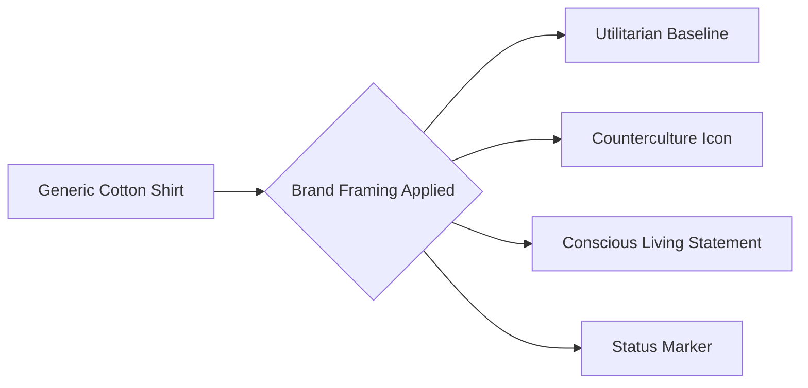

# Chapter 4: Case Study: Framing the Plain White T-Shirt

## The Object of Study
A plain white cotton crewneck T-shirt represents zero baseline differentiation. Its utility is identical across all brands: covering the torso with woven yarn. Because the physical substrate does not vary, it serves as the ultimate test of persuasion, brand archetypes, and visual language.

## Four Divergent Campaigns

### 1. Campaign One: The Essential Uniform (Sage / Modernist)
- **Concept:** Scientific reduction of clothing fatigue.
- **Visuals:** Pure white backgrounds, precise Swiss layout, monochrome sans-serif text.
- **Persuasive Driver:** Authority and simplicity. "The perfect weight, perfected over 1,000 iterations."

### 2. Campaign Two: The Rebel Standard (Outlaw / Postmodernist)
- **Concept:** Anti-fashion defiance against disposable corporate trends.
- **Visuals:** Low-fidelity flash photography, raw edges, gritty high-contrast typography.
- **Persuasive Driver:** Unity and social proof. "Not made for everyone. Made for the few who don't care."

### 3. Campaign Three: The Honest Origin (Caregiver / Organic Modernism)
- **Concept:** Fair-trade regenerative agriculture and artisan livelihood.
- **Visuals:** Earthy neutrals, soft rounded card containers, soil transparency metrics.
- **Persuasive Driver:** Reciprocity and ethical alignment. "Wear your values."

### 4. Campaign Four: The Heritage Artifact (Ruler / Classic Elegance)
- **Concept:** Quiet luxury and understated prestige.
- **Visuals:** Generous negative space, refined serif headings, curated studio lighting.
- **Persuasive Driver:** Scarcity and perceived status. "Hand-stitched in limited seasonal runs."

## Campaign Matrix

| Campaign | Archetype | Visual Philosophy | Key Persuasion Principle | Price Point |
| :--- | :--- | :--- | :--- | :--- |
| **The Essential** | Sage | Modernist Grid | Authority | $30 |
| **The Rebel** | Outlaw | Postmodern Collage | Unity | $65 |
| **The Honest** | Caregiver | Soft Minimal | Reciprocity | $45 |
| **The Heritage** | Ruler | Classical Luxury | Scarcity | $120 |

## Consumer Perception Flow

### Ethical Synthesis
The study of framing reveals that designers do not merely sell objects; they construct meaning. The boundary between ethical storytelling and predatory manipulation lies in the alignment between message and reality.
