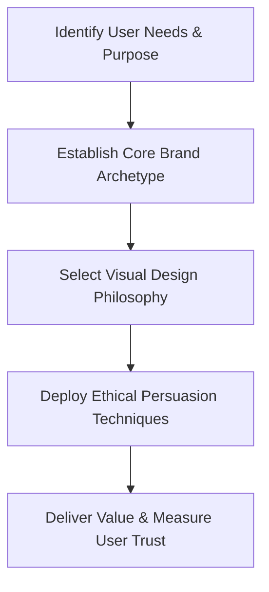

# Chapter 5: Synthesis and Design Strategy

## Connecting the Frameworks
A successful digital product harmonizes three interdependent layers:
1. **Behavioral Persuasion:** Understanding cognitive biases, reciprocity, and decision pathways to respect user autonomy while guiding action.
2. **Brand Archetypes:** Providing an authentic emotional persona that creates long-term trust and distinct identity.
3. **Visual Design Language:** Selecting a coherent aesthetic philosophy (Modernist clarity versus Postmodern expression) that supports both function and tone.

## The Unified Design Decision Loop

### Strategic Checklist for Web Designers
Transparency: Are fees, commitments, and terms clearly declared?

Cognitive Load: Does the visual hierarchy guide attention smoothly without overwhelming?

Archetypal Consistency: Does every UI component, microcopy snippet, and interaction reinforce the same brand personality?

Audience Respect: Is refusal made as easy, frictionless, and safe as agreement?

